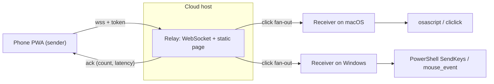

# Realtime Click Bridge — Implementation Plan

> **For agentic workers:** implement this plan task-by-task. Steps use checkbox (`- [ ]`) syntax for tracking. Each task ends with a verify step and a commit.

**Goal:** Tap a button on a phone and have a chosen computer (macOS or Windows) fire a real mouse click or keystroke, in real time, from anywhere on the internet.

**Architecture:** Three small pieces. A stateless **relay** (a WebSocket server) runs on a cheap always-on cloud host and forwards signals, because the target computer sits behind NAT and the phone cannot reach it directly. A **phone sender** is a single static web page (installable as a home-screen PWA) that opens a WebSocket to the relay and emits one message per tap. A **cross-platform receiver** is a small Node process on the target computer that connects out to the relay and synthesizes the input event using OS-native tools. Everything is gated by one shared secret.

```
phone (sender) ──▶ relay (cloud WebSocket) ──▶ receiver (macOS or Windows) ──▶ real click/keystroke
```

**Tech stack:** Node.js 18+, the `ws` WebSocket library, plain HTML/CSS/JS for the phone page, Fly.io (or Render/Railway/a VPS) for the relay, macOS `osascript`/`cliclick`, Windows PowerShell `SendKeys`/`mouse_event`. No database, no auth provider, no build step.

---

## Non-Goals (explicitly out of scope)

This plan deliberately **replaces** an earlier over-scoped design. The following are intentionally excluded because a phone-to-computer click trigger does not need them:

- Oracle Cloud (OCI) infrastructure, Terraform, Container Registry, Vault, Object Storage.
- PostgreSQL, an event log, a transactional outbox, or at-least-once delivery guarantees.
- OIDC/MFA identity, role authorization, or per-user accounts.
- FCM push, background wake-up, or a native Android app.
- A Tauri desktop shell, a React SPA, or TanStack/Vite tooling.
- 5,000-connection load targets, k6 profiles, OpenTelemetry, or multi-role image dispatch.
- Any sportsbook scraping, credential automation, or automated wagering.

A click is only meaningful **live**: if no receiver is connected when the phone taps, the correct behavior is to tell the user "no receiver connected," not to persist and replay the click later. That single decision removes almost all of the retired complexity.

---

## Design Decisions

- **Delivery is fire-and-forget with an ack.** The phone sends a click; the relay fans it out to every connected receiver and returns an `ack` with the delivered count and original timestamp so the phone can display round-trip latency. No persistence.
- **The receiver performs one fixed action.** The phone message carries no key, command, or coordinates — only `{type:"click"}`. What a click *does* is decided locally on the receiver via the `ACTION` environment variable. Even if the shared secret leaks, an attacker can only repeat that one configured action, never run arbitrary input or commands on the machine.
- **One shared secret gates everything.** Both sender and receiver present `token` on connect; the relay drops any upgrade without it.
- **Connections self-heal.** 25-second WebSocket ping/pong keeps idle connections alive through host/proxy timeouts; both clients reconnect with capped exponential backoff.
- **The receiver is one codebase.** It detects the OS at startup and dispatches to native tooling; there is no separate Mac vs Windows build.

## Definition of Done

- A phone tap causes the connected computer to fire the configured click or keystroke within one network round trip.
- The same `ACTION` names produce equivalent behavior on macOS and Windows.
- With no receiver connected, the phone shows "no receiver connected" rather than failing silently.
- A dropped WebSocket (sleep, network change, relay restart) reconnects automatically on both phone and receiver.
- A connection presenting a wrong or missing `token` is rejected at upgrade.
- The relay holds no durable state; restarting it loses nothing but live connections, which reconnect.
- The phone page installs to the home screen and shows connection status and measured latency.

## Runtime Topology



## Repository Layout

```text
click-bridge/
├── README.md
├── PLAN.md
├── relay/
│   ├── package.json
│   ├── server.js            # HTTP static page + WebSocket relay + token gate + heartbeat
│   ├── fly.toml             # always-on deploy config
│   └── public/
│       └── index.html       # phone sender PWA (one button)
└── receiver/
    ├── package.json
    └── receiver.js          # cross-platform receiver (macOS + Windows)
```

## Stable Interfaces

**WebSocket URL:** `wss://<relay-host>/?token=<secret>&role=sender|receiver`
Upgrade is rejected with `401` when `token` does not match the relay's `AUTH_TOKEN`.

**Messages:**

```text
sender  -> server   : { "type": "click", "at": <epoch-ms> }
server  -> receiver : { "type": "click", "at": <original epoch-ms> }
server  -> sender   : { "type": "ack",   "at": <original>, "receivers": <count> }
both              : WebSocket ping/pong every 25s
```

**Relay HTTP:** `GET /` serves the phone page; `GET /healthz` returns `ok`.

**ACTION model (receiver, identical names on both OSes):**

```text
click        left mouse click at the current cursor position
key:<name>   space | enter | esc | tab | up | down | left | right
             backspace | delete | home | end | pageup | pagedown
char:<c>     type a literal character, e.g. char:a
```

## Task Order

```text
1 -> 2 -> 3 -> 4 -> 5 -> 6 -> 7
                              ├─> 8  (optional: LAN low-latency mode)
                              └─> 9  (optional: richer input via nut-js)
```

---

### Task 1: Bootstrap the Repository

**Files:** `click-bridge/README.md`, `relay/package.json`, `receiver/package.json`

- [ ] **Step 1:** Create the directory tree from *Repository Layout*.
- [ ] **Step 2:** Add `relay/package.json` and `receiver/package.json`, each `"type": "module"`, `"engines": { "node": ">=18" }`, dependency `"ws": "^8.18.0"`, and a `start` script.
- [ ] **Step 3:** Run `cd relay && npm install` and `cd receiver && npm install`; confirm both resolve `ws` with no errors.
- [ ] **Step 4:** Commit.

```bash
git init && git add . && git commit -m "chore: bootstrap click-bridge workspace"
```

### Task 2: Build the Relay

**Files:** `relay/server.js`

**Behavior:** Serve the phone page over HTTP, accept WebSocket upgrades, reject any upgrade whose `token` query param does not equal `AUTH_TOKEN`, track receivers in a set, forward each sender `click` to every open receiver, ack the sender with the delivered count, and run a 25-second heartbeat.

- [ ] **Step 1:** Fail closed on startup if `AUTH_TOKEN` is unset or shorter than 16 characters.
- [ ] **Step 2:** Implement the HTTP handler: `GET /` → `public/index.html`, `GET /healthz` → `ok`, else `404`.
- [ ] **Step 3:** Implement the upgrade handler with the token gate:

```js
if (url.searchParams.get("token") !== AUTH_TOKEN) {
  socket.write("HTTP/1.1 401 Unauthorized\r\n\r\n");
  socket.destroy();
  return;
}
```

- [ ] **Step 4:** On a sender `click`, fan out `{type:"click", at}` to every open receiver and reply `{type:"ack", at, receivers:<count>}`. Ignore any message that is not `{type:"click"}`.
- [ ] **Step 5:** Add a 25-second `ping`; terminate any connection that missed the previous `pong`.
- [ ] **Step 6: Verify.** Start with `AUTH_TOKEN=testsecret1234567 npm start`. From a second terminal, open one receiver-role and one sender-role WebSocket; confirm a sender click is delivered to the receiver and the sender gets an ack with `receivers: 1`. Confirm a connection without the token gets `401`.
- [ ] **Step 7:** Commit `feat: add websocket relay with token gate and heartbeat`.

### Task 3: Build the Phone Sender

**Files:** `relay/public/index.html`

**Behavior:** A single page with one large button. It stores the relay URL and shared secret locally, connects as `role=sender`, sends `{type:"click", at:Date.now()}` on tap, reconnects on drop, and displays connection status plus round-trip latency from the ack. Installable to the home screen.

- [ ] **Step 1:** Add PWA meta tags (`viewport` with `viewport-fit=cover`, `apple-mobile-web-app-capable`, `theme-color`) and a settings dialog capturing **Relay URL** and **shared secret**, persisted in `localStorage`.
- [ ] **Step 2:** Connect to `wss://<relay>/?token=<secret>&role=sender`; on `open` mark connected and enable the button; on `close` disable and retry with backoff capped at 8s.
- [ ] **Step 3:** On tap send `{type:"click", at:Date.now()}` and give haptic feedback via `navigator.vibrate(10)` where available.
- [ ] **Step 4:** On `ack`, show `delivered to N · <rtt> ms` using `Date.now() - ack.at`, or `no receiver connected` when `receivers === 0`.
- [ ] **Step 5:** Meet a quality floor: responsive on a phone viewport, visible focus, `prefers-reduced-motion` respected.
- [ ] **Step 6: Verify.** Load `http://localhost:8080` in a mobile browser (or responsive emulation), enter settings, and confirm the status dot goes live and taps report a latency.
- [ ] **Step 7:** Commit `feat: add phone sender pwa`.

### Task 4: Build the Cross-Platform Receiver

**Files:** `receiver/receiver.js`

**Behavior:** Connect out to the relay as `role=receiver`, detect the OS with `os.platform()`, and on each `click` perform the single action named by `ACTION`. Reconnect with capped backoff.

- [ ] **Step 1:** Require `RELAY_URL` and `AUTH_TOKEN`; default `ACTION=key:space`.
- [ ] **Step 2:** Implement `splitAction` for `click`, `key:<name>`, `char:<c>`.
- [ ] **Step 3: macOS dispatch.** `click` → `cliclick c:.`; `key:<name>` → `osascript -e 'tell application "System Events" to key code <N>'` via a name→keycode map (space 49, enter 36, esc 53, tab 48, up 126, down 125, left 123, right 124, backspace 51, delete 117, home 115, end 119, pageup 116, pagedown 121); `char:<c>` → `osascript` `keystroke`.
- [ ] **Step 4: Windows dispatch.** Build a PowerShell command run via `powershell -NoProfile -NonInteractive -Command`. `key:<name>` → `SendKeys` token (`{ENTER}`, `{ESC}`, `{UP}`, space, …); `char:<c>` → `SendKeys` with metacharacters `+^%~(){}[]` brace-escaped; `click` → `Add-Type` `mouse_event(2,…)` then `mouse_event(4,…)`.
- [ ] **Step 5:** Reject unknown platforms and unknown action names with a clear log line; never fall through to shell.
- [ ] **Step 6: Verify.** On the target machine run `RELAY_URL=wss://... AUTH_TOKEN=... ACTION=key:space npm start`, focus a text field, tap the phone, and confirm the key fires. Repeat with `ACTION=click`.
- [ ] **Step 7:** Commit `feat: add cross-platform receiver`.

### Task 5: Wire the Secret and Run End-to-End Locally

- [ ] **Step 1:** Generate a secret: `openssl rand -hex 24` (macOS/Linux) or the PowerShell one-liner in the README.
- [ ] **Step 2:** Start the relay locally with that `AUTH_TOKEN`.
- [ ] **Step 3:** Point the receiver and the phone page at the local relay (use your machine's LAN IP so the phone can reach it) with the same secret.
- [ ] **Step 4: Verify the full path:** phone tap → ack with `receivers: 1` and a latency → the computer performs the action. Kill the receiver and confirm the phone now shows `no receiver connected`.

### Task 6: Deploy the Relay

**Files:** `relay/fly.toml`

- [ ] **Step 1:** In `relay/`, set a unique app name and a region near where the phone will be. Keep `auto_stop_machines = false` and `min_machines_running = 1` so the receiver stays connected.
- [ ] **Step 2:** `fly launch --no-deploy` then `fly secrets set AUTH_TOKEN=<secret>` then `fly deploy`.
- [ ] **Step 3:** Point the phone page and the receiver at `wss://<app>.fly.dev`.
- [ ] **Step 4: Verify** the end-to-end path over the internet and record the observed latency. Confirm `GET /healthz` returns `ok`.
- [ ] **Step 5:** Commit `chore: add relay deploy config`.

### Task 7: Security and Reliability Gates

A candidate is not "done" until all of these pass:

- [ ] **Auth:** a WebSocket without the correct `token` receives `401`.
- [ ] **No injection:** confirm the phone can send nothing but `{type:"click"}`; the receiver never executes text supplied by the sender.
- [ ] **Secret hygiene:** `AUTH_TOKEN` exists only as a host secret and local env, never committed. `git grep` finds no secret-like strings.
- [ ] **Reconnect:** sleeping the phone, switching WiFi/cellular, and restarting the relay each recover without a manual refresh.
- [ ] **Permissions documented:** macOS Accessibility grant and the Windows "run as admin to reach an elevated app" caveat are in the README.
- [ ] **Rotation:** rotating `AUTH_TOKEN` (update host secret + restart receiver + update phone settings) fully cuts off the old secret.
- [ ] Commit `docs: record security and reliability gates`.

---

### Task 8 (Optional): LAN Low-Latency Mode

When the phone and computer are on the same network and you need single-digit-millisecond latency, drop the relay entirely: run the WebSocket server directly on the target computer and have the phone connect to its LAN IP.

- [ ] **Step 1:** Run `relay/server.js` on the target machine bound to the LAN interface; the receiver logic can be merged into the same process (skip the fan-out and act directly on each click).
- [ ] **Step 2:** Point the phone at `ws://<computer-lan-ip>:8080`. Serve over HTTP on LAN or add a self-signed cert for `wss`.
- [ ] **Step 3: Verify** latency is now dominated by WiFi (typically <10 ms) and no traffic leaves the network.

### Task 9 (Optional): Richer Input Control

If you need mouse **movement to coordinates**, drag, scroll, or multi-key combinations across both OSes, replace the shell-outs in `receiver.js` with `@nut-tree/nut-js` for a uniform cross-platform input API. This adds a native build step, so keep it optional. Extend the message shape to `{type:"action", name, ...args}` and, critically, whitelist the allowed actions on the receiver so the internet-facing surface still cannot request arbitrary input.

---

## Deployment Runbook (quick reference)

```bash
# 1. secret
openssl rand -hex 24

# 2. relay
cd relay && fly launch --no-deploy
fly secrets set AUTH_TOKEN=<secret>
fly deploy

# 3. receiver (on the target computer)
cd receiver && npm install
# macOS:
RELAY_URL=wss://<app>.fly.dev AUTH_TOKEN=<secret> ACTION=key:space npm start
# Windows PowerShell:
$env:RELAY_URL="wss://<app>.fly.dev"; $env:AUTH_TOKEN="<secret>"; $env:ACTION="key:space"; npm start

# 4. phone
# open https://<app>.fly.dev, enter relay URL + secret in ⚙, Add to Home Screen
```

macOS: grant Terminal (or the packaged app) **Accessibility** in System Settings → Privacy & Security → Accessibility, or synthesized input silently no-ops.
Windows: to drive an app running **as administrator**, run the receiver as administrator too.
